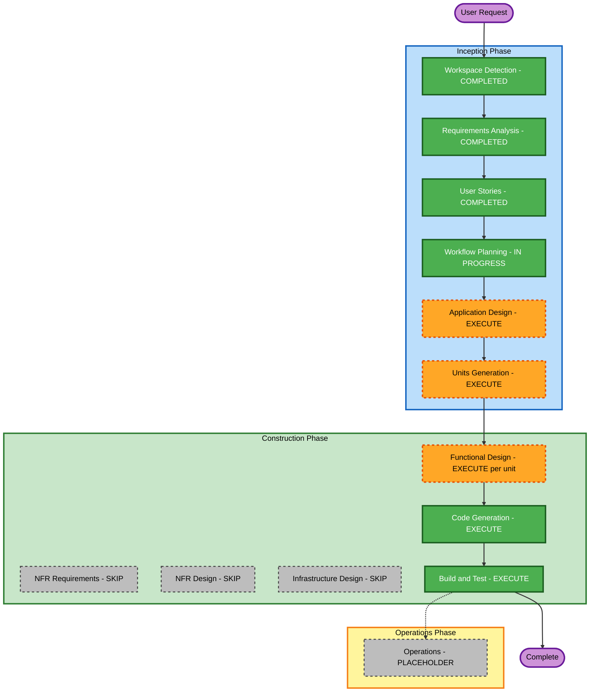

# Execution Plan — Delivery Tracking & Driver Console

## Detailed Analysis Summary

### Project Type
Greenfield — no existing codebase, no transformation/brownfield analysis applicable.

### Change Impact Assessment
- **User-facing changes**: Yes — three new UIs (Customer, Driver, Admin), all net-new.
- **Structural changes**: Yes — entire system architecture is being defined from scratch (backend API/SSE service + SQLite + 3 frontend apps).
- **Data model changes**: Yes — new entities: Delivery, Driver, Camp, StatusHistory, Admin User.
- **API changes**: Yes — all endpoints and the SSE channel are new.
- **NFR impact**: Yes, but already fully specified in `requirements.md` (12h/16h session expiry, bcrypt hashing, 2-second SSE latency, demo-scale, local-only deployment) and confirmed via clarifying questions — no open NFR decisions remain that would require a dedicated NFR stage.

### Risk Assessment
- **Risk Level**: Low-to-Medium — no production deployment, no real integrations, no advanced security/compliance requirements (Security/Resiliency/PBT extensions all opted out). Main risk is scope/complexity from 3 personas and real-time sync, not technical risk.
- **Rollback Complexity**: Easy — greenfield, local-only, no live traffic.
- **Testing Complexity**: Moderate — real-time SSE behavior and multi-persona state sync need care during Build and Test.

## Workflow Visualization



### Text Alternative
```
Phase 1: INCEPTION
- Workspace Detection (COMPLETED)
- Requirements Analysis (COMPLETED)
- User Stories (COMPLETED)
- Workflow Planning (IN PROGRESS)
- Application Design (EXECUTE)
- Units Generation (EXECUTE)

Phase 2: CONSTRUCTION (per unit of work)
- Functional Design (EXECUTE, per unit)
- NFR Requirements (SKIP)
- NFR Design (SKIP)
- Infrastructure Design (SKIP)
- Code Generation (EXECUTE, always)
- Build and Test (EXECUTE, always, after all units)

Phase 3: OPERATIONS
- Operations (PLACEHOLDER)
```

## Phases to Execute

### 🔵 INCEPTION PHASE
- [x] Workspace Detection (COMPLETED)
- [x] Reverse Engineering (SKIPPED — greenfield, N/A)
- [x] Requirements Analysis (COMPLETED)
- [x] User Stories (COMPLETED)
- [x] Workflow Planning (IN PROGRESS — this document)
- [ ] Application Design — **EXECUTE**
  - **Rationale**: The system needs multiple new services/components defined (delivery lifecycle service, auth/session service, assignment service, SSE broadcast service, master-data service) with clear method signatures and responsibilities before decomposing into units. This is a brand-new system with no existing component boundaries to reuse.
- [ ] Units Generation — **EXECUTE**
  - **Rationale**: The system naturally decomposes into independently workable units — a backend API/SSE service and three separate frontend apps (Customer, Driver, Admin) — matching the confirmed project structure (single repo, separate backend + frontend builds). Units Generation will define these units and their dependencies explicitly.

### 🟢 CONSTRUCTION PHASE (executed per unit)
- [ ] Functional Design — **EXECUTE** (per unit, primarily the backend unit)
  - **Rationale**: New data models (Delivery, Driver, Camp, StatusHistory) and non-trivial business rules (status-transition ordering, request-note edit lockout after "out for delivery," re-delivery-target flagging, duplicate validation) need explicit design before coding.
- [ ] NFR Requirements — **SKIP**
  - **Rationale**: Tech stack is already fully decided (Node.js+TS, SQLite, plain HTML/CSS/JS) via the Requirements Analysis clarifying questions. All applicable NFRs (session durations, SSE latency target, bcrypt hashing, demo-scale, local deployment) are already explicit in `requirements.md`. No open NFR decisions remain, and the Security/Resiliency/PBT extensions were explicitly opted out.
- [ ] NFR Design — **SKIP**
  - **Rationale**: Dependent on NFR Requirements, which is skipped.
- [ ] Infrastructure Design — **SKIP**
  - **Rationale**: Deployment target is local-only (localhost); no cloud resources, load balancers, or deployment architecture to map.
- [ ] Code Generation — **EXECUTE** (ALWAYS, per unit)
  - **Rationale**: Implementation planning and code generation needed for every unit.
- [ ] Build and Test — **EXECUTE** (ALWAYS, after all units)
  - **Rationale**: Build, unit/integration test instructions needed, with particular attention to SSE real-time behavior across units.

### 🟡 OPERATIONS PHASE
- [ ] Operations — **PLACEHOLDER**
  - **Rationale**: Future deployment/monitoring workflows; not applicable to this local-only workshop MVP.

## Estimated Timeline
- **Total Stages to Execute**: 7 (Application Design, Units Generation, Functional Design [per relevant unit], Code Generation [per unit], Build and Test) across INCEPTION + CONSTRUCTION
- **Stages Skipped**: 3 (NFR Requirements, NFR Design, Infrastructure Design) — all with clear rationale above
- **Estimated Duration**: Suitable for a one-day workshop scope; no multi-week timeline needed given demo-scale and local-only deployment

## Success Criteria
- **Primary Goal**: Working local demo covering all Core MVP features (Customer, Driver, Admin) from `requirements.md`, with real-time SSE sync across all three UIs
- **Key Deliverables**:
  - Backend API/SSE service (Node.js + TypeScript + SQLite)
  - Three frontend apps: Customer, Driver, Admin (plain HTML/CSS/JS)
  - Seed data script
  - Build and run instructions
- **Quality Gates**:
  - All 16 core functional requirements (FR-C1–C4, FR-D1–D4, FR-A1–A5, FR-S1–S2) implemented and traceable to their user story
  - Status changes propagate across UIs within 2 seconds via SSE
  - Passwords hashed with bcrypt; sessions expire per spec (12h driver / 16h admin)
